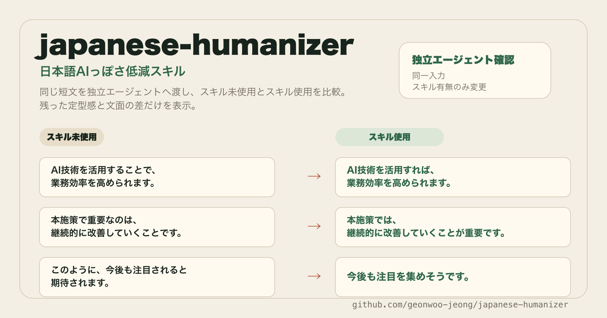

<p align="center">
  
</p>

# japanese-humanizer — AI文を、自然な日本語へ

AI文を、**内容は変えずに**、文体・リズム・係り受け・表現だけ自然な日本語へ整える Agent Skill です。

ChatGPT、Claude、Gemini などの出力に残りやすい、翻訳調、過剰に整った構成、冗長な言い回し、温度のない結論、均一すぎる文末を見つけ、意味を守りながら局所的に直します。

これは「AI検出器を通すための言い換え」ではありません。文章の出自判定もしません。目的は、読み手が引っかかる機械的な硬さや定型感をほどき、文章本来の用途に合う日本語へ戻すことです。

## まず何が変わるか

- 「AI技術を活用することによって業務効率を向上させることができます」
  → 「AIを使えば、業務効率を上げられます」
- 「本施策において重要な点は、継続的な改善を実施することです」
  → 「この施策で大事なのは、継続して改善することです」
- 「このように、今後も注目されることが期待されます」
  → 「今後も関心を集めそうです」
- 「分析は、利用者の行動変化を明らかにした」
  → 文脈に応じて「分析から、利用者の行動変化が分かった」のように直します。

## なぜ日本語特化か

日本語のAI文は、単に「硬い」「丁寧すぎる」だけではありません。英語の語順や主語の立て方、機械翻訳後の均質化、サ変名詞の連続、文末の単調さ、接続表現の型化が重なって不自然に見えることがあります。

このリポジトリでは、それらを `taxonomy.md` のカテゴリIDと `quick-rules.md` の処方に分け、必要に応じて `rewrite_priority_score` で修正順を決めます。短い文章は高速に、長い文章や説明が必要な文章は根拠付きで扱えます。

## 4つの約束

1. **意味を変えない** — 事実、数値、固有名詞、引用、条件、否定、責任主体を保ちます。
2. **足さない** — 原文にない具体例、体験、根拠、感情を勝手に補いません。
3. **ジャンルを守る** — レポートをエッセイにせず、小説を説明文にしません。
4. **過剰に直さない** — 受動態、外来語、抽象語、専門語を機械的に消しません。

## インストール

公開先リポジトリは `geonwoo-jeong/japanese-humanizer` です。

### skills.sh

```bash
npx skills add geonwoo-jeong/japanese-humanizer
```

### GitHub CLI

```bash
gh skill install geonwoo-jeong/japanese-humanizer japanese-humanizer --agent codex
```

`--agent` を省略すると、非対話環境では GitHub Copilot が既定のインストール先になる場合があります。Codex、Claude Code、Cursor などへ入れる場合は対象を明示してください。

### Claude Code

```text
/plugin marketplace add geonwoo-jeong/japanese-humanizer
/plugin install geonwoo-jeong@japanese-humanizer
```

新しいセッションで、自然文または `$japanese-humanizer` から使えます。

### Codex

```bash
codex plugin marketplace add geonwoo-jeong/japanese-humanizer
codex plugin add geonwoo-jeong@japanese-humanizer
```

### Cursor

Cursor の marketplace import 機能でこのリポジトリを追加し、`japanese-humanizer` プラグインを選択してください。マーケットプレイス定義は `.cursor-plugin/marketplace.json`、プラグイン本体は `plugins/japanese-humanizer` にあります。

## 使い方

自然に頼めば動きます。

```text
$japanese-humanizer を使って、このAI文を自然な日本語へ整えてください。

[ここに文章を貼り付ける]
```

用途を添えると、文体を合わせやすくなります。

```text
$japanese-humanizer
用途: 採用候補者へ送るメール
強さ: 控えめ
条件: 意味と敬意表現を変えない

[ここに文章を貼り付ける]
```

理由付きで見たい場合は、次のように頼みます。

```text
$japanese-humanizer を使って、修正後の本文と修正理由を表で出してください。
```

長文を先に診断したい場合は、ローカルスクリプトを使えます。

```bash
node plugins/japanese-humanizer/skills/japanese-humanizer/scripts/profile-japanese-text.mjs path/to/input.txt
```

## 処理の流れ

```text
入力文
  ↓
保護対象を確認
  数値、引用、固有名詞、専門用語、条件、否定、責任主体
  ↓
機械的な定型感・翻訳調を分類
  quick-rules.md / taxonomy.md
  ↓
修正優先度を決定
  P1: 安全に直せる表層修正
  P2: 文脈を見て直す修正
  P3: 監査中心の高次判断
  ↓
意味を保ったまま書き換え
  ↓
事実保持と過剰修正を監査
```

## 分類体系の要約

| 領域 | 見るもの | 例 |
| --- | --- | --- |
| 翻訳調 | 欧文直訳、受動態、無生物主語、代名詞過多 | 「〜によって」「それは」「分析は示す」 |
| 冗長表現 | 可能表現、サ変名詞、形式名詞 | 「することができる」「検討を行う」「重要な点」 |
| 係り受け | 長文、読点、助詞連続、長い連体修飾 | 「制度の変更の影響の確認」 |
| AI風構成 | 定型的な接続、均質な箇条書き、総論的な締め | 「まず」「さらに」「このように」 |
| post-editese | 機械翻訳後の単純化、標準化、原文干渉 | 語順の硬さ、語彙の平板化 |
| 文体混在 | 敬体と常体、硬さ、読者との距離 | 「です・ます」と「である」の混在 |

詳細は `plugins/japanese-humanizer/skills/japanese-humanizer/references/` に分けています。

```text
taxonomy.md             # カテゴリID、根拠Grade、誤検出リスク、P1/P2/P3
quick-rules.md          # よく出る定型感への高速処方
revision-playbook.md    # 書き換え順、監査、出力形式、例外判断
evidence.md             # 学術資料・公的資料・実装参考の位置付け
```

## 配布構成

```text
skills/japanese-humanizer/SKILL.md       # ルートから参照できるスキル入口
.claude-plugin/marketplace.json          # Claude Code 用マーケットプレイス
.agents/plugins/marketplace.json         # Codex 用マーケットプレイス
.cursor-plugin/marketplace.json          # Cursor 用マーケットプレイス
plugins/japanese-humanizer/              # 各エージェントがインストールするプラグイン本体
skills.sh.json                           # skills.sh 用グルーピング
skills.json                              # 汎用カタログメタデータ
marketplaces/profile.json                # 外部ディレクトリ提出用の共通プロフィール
marketplaces/submissions/                # サービス別の提出メモ
```

スキル本文の単一原本は `plugins/japanese-humanizer/skills/japanese-humanizer/SKILL.md` です。ルートの `skills/japanese-humanizer` はそこへのシンボリックリンクで、Claude Code、Codex、Cursor、skills.sh、GitHub CLI の各配布経路が同じ実体を参照します。

## 外部ディレクトリ対応

skills.sh 以外の Agent Skill ディレクトリへ提出する情報は `marketplaces/` に集約しています。共通プロフィールは `marketplaces/profile.json`、サービス別に貼り付ける提出文は `marketplaces/submissions/` にあります。

LobeHub Skills、SkillsMP、SkillsLLM、MCPServers Agent Skills、MCP Market、ClaudeSkills.info、AwesomeSkill.ai、Shyft Skills、OneAway Skills などに対応できるよう、公開 URL、提出 URL、状態、固定説明文を分けて管理します。スキル実行に不要な情報は `SKILL.md` へ入れず、配布・掲載のための情報だけをここで扱います。

## やらないこと

- AI検出器の通過保証、検出回避、出自偽装
- 「AIが書いた文章かどうか」の判定
- 原文にない根拠、経験、数値、具体例の追加
- 法務、医療、金融、契約、研究文書の意味を変える大胆な言い換え
- 専門用語や引用を、自然さだけを理由に置き換えること

## 開発と検証

検証は Node.js だけで実行できます。

```bash
npm test
```

新しい文章、UI文言、ドキュメント、コードコメント、テストデータ、コミットメッセージは日本語で記述します。外部API名、コマンド、ファイル名、識別子など、技術上そのまま扱う必要がある語は既存の慣習と互換性を優先します。

## 出典・参考資料

このスキルは、以下の資料を「文章の出自判定」ではなく、自然な日本語へ整えるための監査信号と修正優先度の根拠として参照しています。

### 日本語文体・AI文体の計量研究

- [Zaitsu & Jin 2023, PLOS ONE](https://journals.plos.org/plosone/article?id=10.1371%2Fjournal.pone.0288453)
- [Zaitsu et al. 2024, PLOS ONE](https://journals.plos.org/plosone/article?id=10.1371%2Fjournal.pone.0299031)
- [PLOS ONE 2025, multi-LLM stylometry](https://journals.plos.org/plosone/article?id=10.1371%2Fjournal.pone.0335369)
- [Frontiers 2026, Japanese LLM fingerprint](https://www.frontiersin.org/journals/artificial-intelligence/articles/10.3389/frai.2026.1771115/full)
- [大西夢「AI生成文からみた『自然な日本語』についての研究」](https://home.hiroshima-u.ac.jp/jshira/papers/AI%E7%94%9F%E6%88%90%E6%96%87%E3%81%8B%E3%82%89%E3%81%BF%E3%81%9F%E3%80%8C%E8%87%AA%E7%84%B6%E3%81%AA%E6%97%A5%E6%9C%AC%E8%AA%9E%E3%80%8D%E3%81%AB%E3%81%A4%E3%81%84%E3%81%A6%E3%81%AE%E7%A0%94%E7%A9%B6%EF%BC%88%E5%A4%A7%E8%A5%BF%E5%A4%A2%EF%BC%89.pdf)

### 翻訳調・post-editese・翻訳後編集

- [Y. F. Meldrum, Translationese-Specific Linguistic Characteristics](https://honyakukenkyu.sakura.ne.jp/shotai_vol3/08_vol3_Meldrum.pdf)
- [阿辺川武ほか「英日翻訳における受動態の訳し方の分析」](https://www.anlp.jp/proceedings/annual_meeting/2009/pdf_dir/P3-18.pdf)
- [Toral 2019, Post-editese](https://aclanthology.org/W19-6627/)
- [AAMT「機械翻訳ポストエディットガイドライン」](https://aamt.info/wp-content/uploads/2025/07/AAMT_PE_Guideline_Ver1.0.pdf)
- [Wang & Li 2025, PMLR](https://proceedings.mlr.press/v278/wang25c.html)
- [JTF「翻訳品質評価ガイドライン」](https://www.jtf.jp/pdf/jtf_translation_quality_guidelines_v1.pdf)
- [JTF「日本語標準スタイルガイド」](https://www.jtf.jp/pdf/jtf_style_guide.pdf)
- [AAMT UTX Specification](https://aamt.info/wp-content/uploads/2019/06/utx1.20-specification-e.pdf)
- [島田紗裕華ほか「機械翻訳向けプリエディットのための情報明示化方略の体系化」](https://www.anlp.jp/proceedings/annual_meeting/2022/pdf_dir/F7-2.pdf)
- [「翻訳者がおこなうプリエディットの有効な手段」](https://www.anlp.jp/proceedings/annual_meeting/2020/pdf_dir/G2-4.pdf)
- [「日本語学を応用した英日翻訳者用教材冊子 OJT 実践報告」](https://www.jstage.jst.go.jp/article/iits/19/0/19_1910/_pdf/-char/ja)

### 日本語翻訳研究・ジャンル・役割語

- [劉明綱「コーパスに見る中日翻訳における『明示化』の特徴」](https://jaits.jpn.org/home/kaishi2010/pdf/08_Liu_MingKang.pdf)
- [石原知英「テクストジャンルによる翻訳プロセスの違い」](https://jaits.jpn.org/home/kaishi2010/pdf/06_Ishihara.pdf)
- [古川弘子「女ことばと翻訳」](https://jaits.jpn.org/home/kaishi2013/01_furukawa.pdf)
- [古川弘子「翻訳・非翻訳小説における女ことば」](https://www.jstage.jst.go.jp/article/its/17/0/17_1705/_article/-char/ja/)
- [日本語用論学会「日本語翻訳と話しことば」関連資料](https://www.jstage.jst.go.jp/article/pragmatics/27/0/27_1/_article/-char/ja)

### 句読点・係り受け・連語・事実性

- [村田匡輝ほか「日本語テキストにおける読点位置の検出」](https://www.anlp.jp/proceedings/annual_meeting/2010/pdf_dir/D3-7.pdf)
- [田野村忠温「日本語コーパスとコロケーション」](https://www.jstage.jst.go.jp/article/gengo/138/0/138_1/_pdf)
- [成田和弥ほか「誤り分析に基づく日本語事実性解析の課題抽出」](https://www.jstage.jst.go.jp/article/jnlp/22/5/22_397/_pdf)

### 公的資料・実装参考

- [文化庁「公用文作成の考え方」](https://www.bunka.go.jp/seisaku/bunkashingikai/kokugo/hokoku/pdf/93651301_01.pdf)
- [JSA「JIS原案作成のための手引」](https://webdesk.jsa.or.jp/pdf/dev/md_1249.pdf)
- [国立国語研究所「外来語」言い換え提案](https://www2.ninjal.ac.jp/gairaigo/Teian1_4/iikae_teian1_4.pdf)
- [国立国語研究所「病院の言葉」](https://www2.ninjal.ac.jp/byoin/)
- [国立国語研究所「ことば研究館」](https://kotoba.ninjal.ac.jp/qa/yokuaru/qa-53/)
- [textlint](https://github.com/textlint/textlint)
- [textlint-rule-preset-ja-technical-writing](https://github.com/textlint-ja/textlint-rule-preset-ja-technical-writing)
